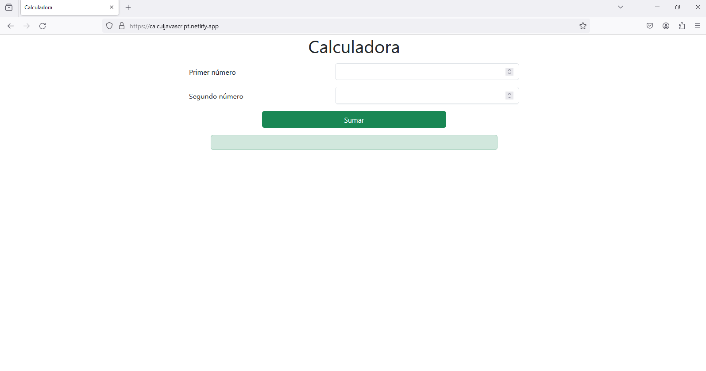

# Calculadora
En este repositorio se encuentra una práctica de uso de HTML5 y JavaScript en la creación de una calculadora en la que se pueden realizar sumas de dos dígitos.

### CAPTURAS DE PANTALLA:

LINK AL SITIO: https://calculjavascript.netlify.app/
